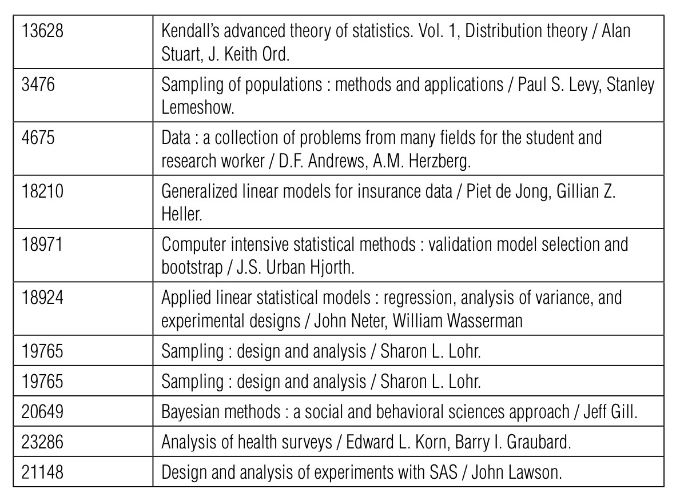

# 第九章－推荐系统

&ensp;&ensp;&ensp;&ensp;如果有数据，那数据说了算。如果没有，那么我说了算。

－前 Netscape CEO Jim Barksdale

## 推荐系统是什么？

&ensp;&ensp;&ensp;&ensp;推荐系统也被称为，推荐引擎。它是一种信息系统，主要用来将物品或者动作显示或者推荐给用户。推荐物品通常由少量的物品－电影，书籍，等等，比如：社交网络中的关注其他用户的推荐。从大的集合中根据一些条件，比如，用户之前表现出来的喜好，来选择出一个小的子集，就是一种很典型的做法。其他可能的条件包括：年龄、性别、和位置。

**以下是推荐系统中常用的几种方法:**

* **内容过滤**

&ensp;&ensp;&ensp;&ensp;内容过滤通过收集辅助信息（比如，用户的人口统计数据，音乐流派，关键词，问卷答案）来为每个物品或者用户来生成一个画像。基于用户画像来匹配物品。例如：Pandora的Music Genome项目。

* **协同过滤**

&ensp;&ensp;&ensp;&ensp;协同过滤是基于用户的过去行为。每个用户的排名，或者浏览记录可以让推荐系统在拥有相同行为用户和相同用户之间的物品兴趣之间建立联系。比如：Netflix。

&ensp;&ensp;&ensp;&ensp;协同过滤，得益于它天然的领域开放性，成为了这几种方法中的可能最流行的方法。在协同过滤系统还可以通过基于邻近的方法（基于用户与用户的距离，或者物品与物品的距离）、因子、降维模型－可以用来自动发现用户或者物品的少量描述因子，来进一步划分。低阶矩阵因子分解是降维模型的最著名的方法，同时它也是推荐系统内部最灵活和成功的方法之一。矩阵分解有很多种变体，包括，可能性和贝叶斯版本。另一种目前最先进的方法是一种深度学习神经网络，受限波尔兹曼机。

## 推荐系统有什么用途？

&ensp;&ensp;&ensp;&ensp;推荐系统的应用十分广泛，它可以应用到任何面向海量用户的多种类商品种销售的商业中。零售商，比如：Amazon，Netflix 以及 Target ，网络电影和音乐，比如：Netflix 和 last.fm , 以及社交网站，比如： Facebook 和 Twitter, 都采用了推荐系统。推荐系统也被应用到杂货店，比如：Tesco。

&ensp;&ensp;&ensp;&ensp;除了上面提及的，零售，媒体，以及社交网站的例子外，推荐系统也被，诸如：Yahoo!，Google，这样的通用网站用基于历史浏览和其他信息来推送最好的广告。推荐系统另外一个应用是在市场决策方面的类似下一个最佳购物建议的应用，例如：Schwan 食品公司就利用推荐系统来提高他们冷冻食品的销量。

## 推荐系统如何工作？

&ensp;&ensp;&ensp;&ensp;我们将会对大多数的推荐系统的底层的基本数学原理进行讲解。首先，我们假设，有一个 $N_u$ 行 $N_i$ 列的排名矩阵 $X$ ，其中， $N_u$ 代表用户的数量， $N_i$ 代表要被排名的物品的数量。 $X$ 中的元素 $x_{ui}$ 代表给用户 $u$ 推荐的物品 $i$ 的排名。我们往往只知道矩阵 $X$ 中的少量元素。假设， 已知的排名以类似： $(u_1,i_i,x_{u_i,i_i})...(u_n,i_n,x_{u_n,i_n})$ 的三元组， 如图9.1所示的方式存储。我们假设已有的排名有 $n$ 个。

### 基本模型

&ensp;&ensp;&ensp;&ensp;推荐系统的基本模型可以定义为：

$$
x_{ui}=b_0+b_u+b_i
$$

其中， $b_0$， $b_u$ ， $b_i$  分别为常量， 用户的偏差，物品的偏差。 $b_0$ 对应全局平均排名， 而 $b_u$ 代表用户 $u$ 从 $b_0$ 开始的平均偏差总数， $b_i$ 代表物品 $i$ 从 $b_0$ 开始的平均偏差总数。模型的目标是对集合 $D$ 中所有的 $u$ 和 $i$ ，估计 $b_0$, $b_u$ 和 $b_i$ 。

&ensp;&ensp;&ensp;&ensp;偏差可以通过解决最小二乘法优化问题来估计。

$$
\min\limits_{b_u,b_i} \sum\limits_{(u,i) \in D} (x_{ui} - b_0 - b_u - b_i)^2+\lambda\lgroup \sum\limits_ub_u^2 + \sum\limits_ib_i^2\rgroup
$$

其中 $b_0$ 为所有已知 $x_{ui}$ 的平均值，第一个子式是模型的观察排名和预测排名的平方误差。  第二个子式是归一化补偿来降低过度拟合时造成的大误差的影响。参数 $\lambda$ 来控制归一化的总值。

## 低阶矩阵因子分解

&ensp;&ensp;&ensp;&ensp;低阶矩阵因子分解提供了一种更加灵活的模型。考虑如下的内积：

$$
x_{ui} = I_u \times r_i
$$

其中 $I_u$ 和 $r_i$ 都是一个 $K$ 维矢量。上面的模型也可以改写为矩阵乘积的形式。

$$
X = LR
$$

如图9.1所述，等式左边的因子矩阵 $L$ 的行由所有用户的 $l_u$ 矢量组成，右边的因子矩阵 $R$ 的列由所有物品的 $r_i$ 矢量组成。在这个模型中，正如模型名—低阶矩阵因子分解而言，矩阵 $X$ 的阶 $K$ 远远比 $N_u$ 和 $N_i$ 要小。

&ensp;&ensp;&ensp;&ensp;与基础模型类似，$L $和 $R$ 的估计可以通过解决如下的优化问题来得到：

$$
\min\limits_{l_u,r_i} \sum\limits_{(u,i) \in D} (x_{ui} - l_ux_i)^2 + \lambda\lgroup\sum_u \parallel l_u\parallel^2 + \sum_i \parallel r_i\parallel^2\rgroup
$$

同样，该模型通过加入因子范式来避免过度拟合。随机梯度下降和交替最小二乘法是解决这个问题的最常用的方法。

## 随机梯度下降法

&ensp;&ensp;&ensp;&ensp;梯度随机下降法首先设定两个初始值， $l_u$，$r_i$ ，然后在此基础上的物体的负梯度方向不断更新相对应的值，如下式：

$$
l_u\leftarrow l_u - \eta (e_{ui}r_i - \lambda l_u)
$$

$$
r_i \leftarrow r_i - \eta(e_{ui}l_u - \lambda r_i)
$$

其中 ：

    $e_{ui} \triangleq x_{ui} - l_u.r_i$ 为 $(u,i)$ 对排名的预测误差。

    $\eta$ 为用户定义的学习步长。

    随机梯度下降，顾名思义，它每进行一次排名，就从数据集 $D$ 中随机选取一对 $(u,i)$ 更新一次。一旦对数据集 $D$ 完成一次完全遍历，也就是说一个周期。算法再次以不同的随机顺序对同样的数据集$D$。算法不断对数据集重复遍历，直到完全覆盖，这通常需要进行数个遍历周期。

     随机梯度下降法并不需要将所有数据集存入内存中，所以这个方法在数据集 $D$很大的时候有很大的优势。

## 交替最小二乘法

&ensp;&ensp;&ensp;&ensp;另一个比较有名的方法是交替最小二乘法，这个算法只有两步。首先，固定右边的 $r_i$ 算出 $l_u$ ，然后通过固定左边 $l_u$算出 $r_i$。每个步骤都可以通过最小二乘法来计算。

&ensp;&ensp;&ensp;&ensp;假设， $n_u$ 为用户 $u$ 的排名数， $R[u]$ 为用户 $u$的物品在 $R$ 集合里面的排名， 矢量$x_u$表示用户 $u$的所有排名，排名顺序和 $R[u]$ 的顺序一致。那么， $I$ 可以通过下式估计：

$$
\begin{bmatrix} R[u]\\\sqrt{\lambda n_u}I_k \end{bmatrix}l_u = \begin{bmatrix}x_u \\0 \end{bmatrix}
$$

其中， $I_k$ 为 $K\times K$ 的矩阵。 $r_i$ 的估计也类似。

&ensp;&ensp;&ensp;&ensp;交替最小二乘法的优点就是比随机梯度下降法更加容易并行化，但是，它同时比随机梯度下降算法需要更大的内存。交替最小二乘法需要将全部数据集加载入内存里面，如果数据集 $D$ 太大的话，可能会出现问题。

## 波兹曼限量机算法

&ensp;&ensp;&ensp;&ensp;除了低阶矩阵因子分解之外，还有很多其他的推荐算法。由于波兹曼限量机算法（RBMS）的逐渐流行，而且实际上，这种方法代表一种完全不同并具有很大竞争力的方法，所以在这部分，我们介绍下这种方法。波兹曼限量机实际上是一个两层带随机神经单元的神经网络。名字中的“限量”两词，是因为模型中的随机神经单元必须在一个二分图里面，如图9.2所示。

&ensp;&ensp;&ensp;&ensp;在波兹曼限量机的可见层神经单元必须和隐藏层神经单元相连，反之亦反之。层与层之间的连接是无向的，这意味着，波兹曼神经网络可以双向工作，隐藏层可以刺激可见层，同样，可见层也可以反过来刺激隐藏层。

&ensp;&ensp;&ensp;&ensp;在推荐设置中，建议为每个用户 $u$ 构造一个单独的波兹曼限量机（RBM）。假设，用户 $u$ 有 $m$ 个排名物品，那么在RBM网络中就有 $m$ 个相对应的可见单元点。

&ensp;&ensp;&ensp;&ensp;第 $k$ 个隐藏单元的输出通常是二元的，用 $h_k( k =1,...,K) $ 表示。第 $i$ 个可见单元的输出用 $v_i（ i = 1, ... , m )$ 表示。在推荐系统中， $v_i$ 通常采用1到Q之间的有序离散值。$v_i$ 中的第 $q$ 个值通常用 $v^q_i$。 $v_i^q$有一定的几率被激活（波兹曼限量机网络会评估 $v_i$ 中的所有值的可能性分布\)。第 $k$ 个隐藏单元和第 $i$ 个可见单元的第 $q$ 个值通过权重 $w^q_{ki}$ 相连。为避免混乱，误差并没有在图9.2中表示，对用户 $u$ 的依赖也被忽略。

&ensp;&ensp;&ensp;&ensp;随机神经网络单元就是网络的输出依赖对网络输入的概率分布而不是一个确切的函数。隐藏单元是二元的，如下：

$$
p(h_k = 1 | v) = \sigma \lgroup\,b_k + \sum_{i=1}^m \sum_{q=1}^Q  v^q_i w^q_{ki}
$$

其中，

$b_k = a $ 是误差，

 $\sigma(x) = 1/(1+e^{-x}) = a $ 是一个 sigmoid函数。

有序的可见神经单元通常遵循如下分类器规则：

$$
p( v^q_i = 1|h) = \frac{exp ( b^q_i + \sum_{k=1}^{K} h_kw^q_ki)}{\sum_{i-1}^Q exp( b_i^l + \sum_{k= 1}^K h_k w^l_{ki})}
$$

其中， $b_i^q$ 为方差。多个用户对同一个物品进行排名，所有的用户网络的共享连接权重和误差，但是每个用户的隐藏和可见的单元有不同的状态。

## 对比散度

&ensp;&ensp;&ensp;&ensp;波兹曼限量机（RBM）的参数是，权重和误差。权重和误差通过最大化可见神经单元的边缘可似性来获得，如下式:

$$
p(V) = \sum_h \frac{exp(-E(V,h))}{\sum_{V’,h’}exp(-E(V’,h’))}
$$

&ensp;&ensp;&ensp;&ensp;其中 $E(V,h)$ 表示网络配置中的能量，通过下式表示：

$$
E(V,h) = - \sum_{i=1}^m\sum_{k=1}^K\sum_{q=1}^Qw_{ki}^qh_kv_i^q+\sum_{i=1}^mlogZ_i - \sum_{i=1}^m\sum_{q=1}^Q v_i^qb_i^q - \sum_{k=1}^Kh_kb_k
$$

其中 $Z_i$是归一化常量，学习是通过 $\log p(V)$ 的梯度上升的方法来进行的。权重通过下式进行更新：

$$
w_{ki}^q \leftarrow w_{ki}^q + \in \frac{\partial\log p(V)}{\partial w_{ki}^q}
$$

$$
\frac{\partial \log p(V)}{\partial w_{ki}^q} = \langle v_i^qh_j\rangle_{data} - \langle v_i^qh_j\rangle_{model}
$$

​其中 $\langle.\rangle$ 表示期望。误差也做如上同样的更新。 $\langle v_i^q h_j \rangle_{data}$ 等于，当网络通过数据集 $D$ 训练时，二元组 $h_i$ 和 $v_i^q$ 同时落在数据集 $D $的频率，表示网络中的可见单元 $v_i^q$ 是在数据集的数据之间。 $\langle v_i^q h_j \rangle_{model}$ 表示学习模型定义的 $v_i^q$ 分布的期望。由于 $\langle v_i^q h_j \rangle_{model}$ 十分难计算，所以我们通常用近似值代替。利用蒙特卡洛对比散度方法，我们可以进行一下估计：

$$
\langle v_i^qh_j\rangle_T \approx \langle v_i^qh_j\rangle_{model}
$$

其中 $\langle v_i^qh_j\rangle_T$ 表示在 T 阶吉布斯抽样算法上的期望。

&ensp;&ensp;&ensp;&ensp;如我们所见，比如，在Netflix竞赛中，RBMS算法在矩阵因式分解比较困难的时候效果很好，反之亦然。正因为这样，一个成功的推荐算法通常同时结合利用矩阵因子分解推荐系统和RBM，来提供组合预测。

## 推荐系统的质量评估

&ensp;&ensp;&ensp;&ensp;评估一个推荐系统的最好标准依赖于实际中的推荐问题。在大多数的应用中，最小平方差（RMSE）通常是一个不错的选择。（最小平方差）RMSE 定义如下：

$$
RMSE = \sqrt{\frac{1}{n}\sum_{(u,i) \in D} (x_{ui} - l_ux_I)^2}
$$

它可以用来评估 $x_{ui}$真实值和预测值的数值上的差异。另外，RMSE还直接和等式1中的大多数矩阵优化方法中的待优化矩阵的数据拟合相关。这种关系和RMBS方法中的对数似然优化类似。

&ensp;&ensp;&ensp;&ensp;在有些场景下面，推荐系统生成的推荐榜单比生成单个特定的预测值 $x_{ui}$ 显得更加重要。当我们可能仅仅需要的是一个排名前 $r$ 的榜单的时候，在这些场景中，我们可能更加倾向于使用信息检索的一个方法，比如说，在 $r$ 处的平均预测均值，一般用 $MAP@r$来表示 。对用户集合 $N_u$ 定义如下：

$$
MAP@r = \frac{1}{N_u}\sum_{u=1}^{N_u} AP_u@r
$$

$$
AP_u@r = \frac{1}{\#relevant_u}\sum_{k=1}^rP_u@k\times I_{u,k}
$$

其中 $AP_u@r$ 表示 $r$ 处用户 $u$ 的平均准确率。$P_u@K$表示$k$ 处的准确率，是与用户 $u$ 相关的前 $k$个结果中的一部分物品。变量 $I_{u,k}$ 表示物品和用户之间的相关性， $I_{u,k}$ 为1时，表示物品 $k$ 与用户 $u$ 相关， $I_{u,k}$ 为0时，表示物品 $k$ 与用户 $u$ 不相关。 $\#relevent_{u}$ 表示与用户 $u$ 相关的物品总数。

&ensp;&ensp;&ensp;&ensp;由于 $MAP@r$ 难以直接优化，所以我们通常用近似值和上界来代替。我们认为通过上界最小化值，和通过先优化RMSE，然后按照预测值 $x_{ui}$ 的降序排列对物品进行排列得到的最小化值相等。

## 推荐系统实战（R语言的SAS库）

&ensp;&ensp;&ensp;&ensp;R语言中，SAS的库中包含用户，书籍，书籍订阅，书籍续订的记录。作为一个应用示例，我们将利用低阶矩阵因子分解的方法来对给定用户是否会订阅或者续订某一本书。该数据集中有2212个用户和6763本书相关的8180条记录。续借次数在0和23之间，但是为了和只被借过一次的书籍和数据遗失的记录区分，我们对其做数据预处理，在原先的次数加上1，使得续借次数在1到24之间。

&ensp;&ensp;&ensp;&ensp;推荐系统的观察值为一个未知完全矩阵 $X$ 的极小离散子集； $X$ 中只有 $\frac{8180}{2212\times6763} = 0.05\%$ 为观察值。

&ensp;&ensp;&ensp;&ensp;我们令 $K=20$ 并在数据集中选择的随机子集上进行40次随机梯度下降训练。剩下的数据用来评估测试误差。该计算过程在一台标准的台式主机上只需花费数秒。结果的RMSE如图9.3所示。

&ensp;&ensp;&ensp;&ensp;与其尝试为一个特定的用户/书籍进行书籍续借的数量，这种本身来说没有用处的预测，为某个用户 $u$ 推荐一个 $r$本书的书单显得更加有趣。为了进行书单推荐，我们需要对所有的书籍 $i$ 进行估算： $\hat{x}_{ui} = I_u.r_i$ ,然后对 $\hat{x}_{ui}$ 的列表降序排列。排名前 $r$就是被推荐的书籍 。值得注意的是，在上面的步骤中，我们进行 $MAP@r$ 度量，因为 $MAP@r$ 度量需要一个可靠的机制来确保每本被推荐的书籍都和每个用户相关。

&ensp;&ensp;&ensp;&ensp;作为一个具体的示例，我们在数据集中挑选一个特定的用户来检查推荐系统的效果。在训练中采用的随机数据子集，如下表9.2。最终由矩阵因子分解模型为该用户生成的10本推荐书籍，如下表9.3。该模型似乎捕捉到了用户对线性回归和经济学方面的主题的兴趣。

